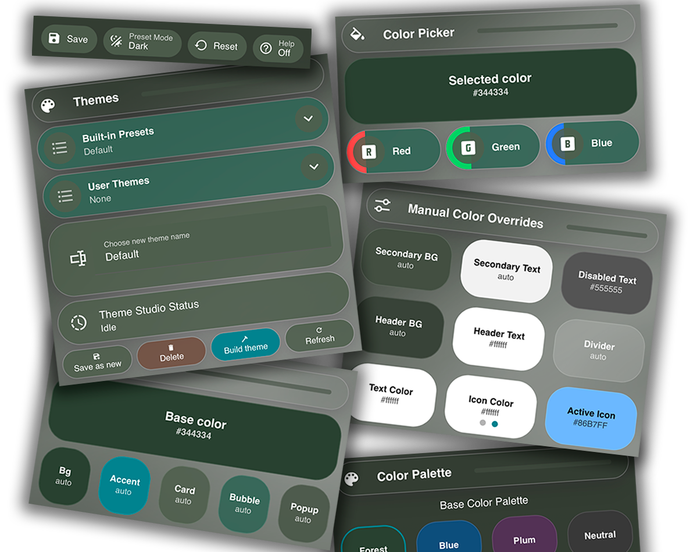
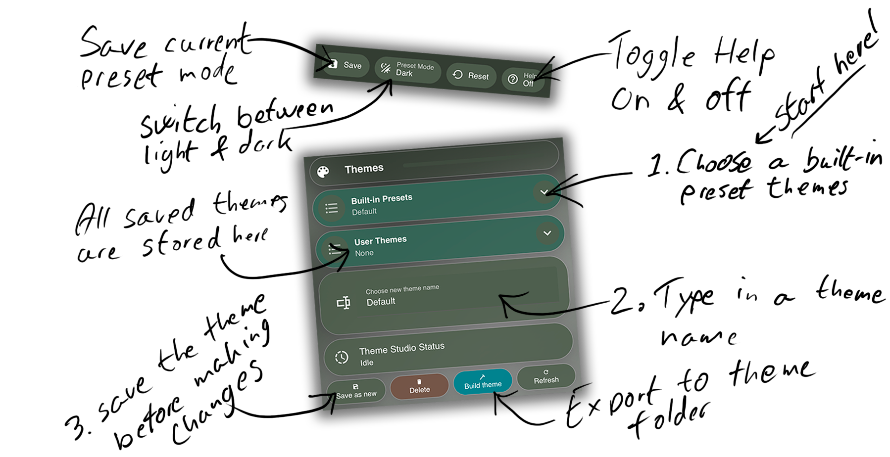
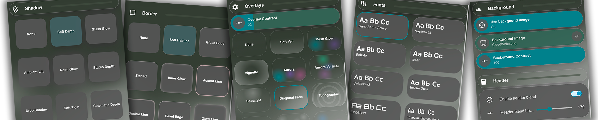
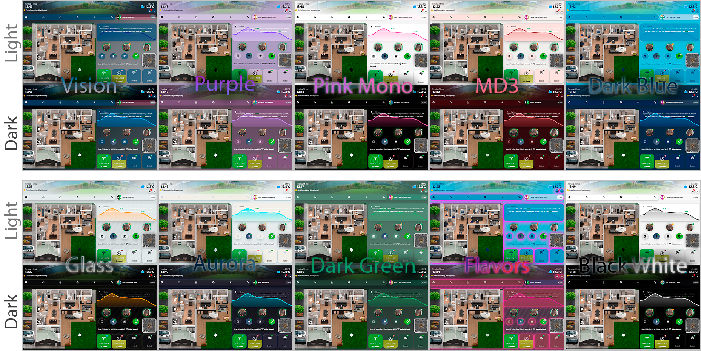
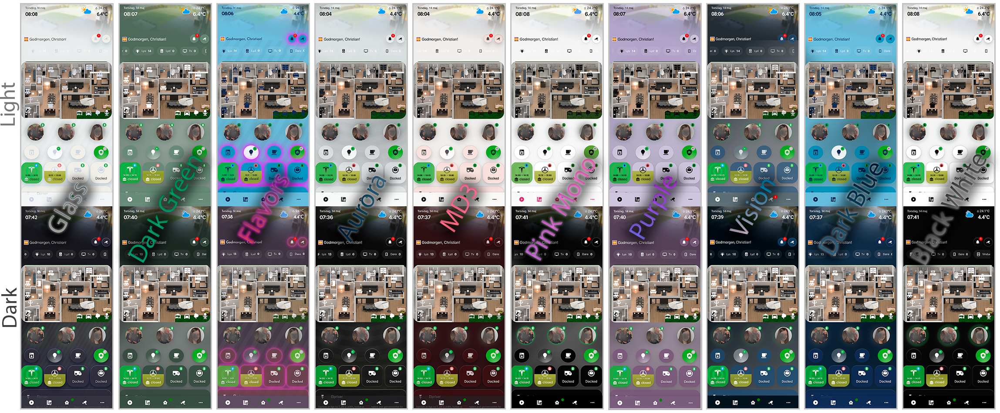
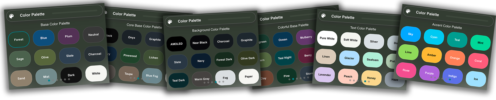

# Theme Studio

<p align="center">
  
</p>

<p align="center">
  <b>Advanced dynamic theming system for Home Assistant</b><br>
  Build, customize and generate complete themes with live preview.
</p>

<p align="center">
  <a href="https://github.com/Dinnsen/theme-studio/releases"></a>
  <a href="https://github.com/hacs/integration"></a>
  <a href="https://buymeacoffee.com/dinnsen"></a>
</p>

---

## Features

- Generate full themes from a **single base color**
- Live preview while editing
- Separate **Light / Dark** workflows
- Built-in presets + custom user themes
- Background images & overlays
- Smart color system, including Home Assistant's own primary color scale (buttons, switches and sliders follow your accent)
- Full YAML theme export that works on its own – no card-mod needed for the exported theme

## Table of Content

- [Requirements](#requirements)
- [Installation](#installation)
- [Workflow](#workflow)
- [What Theme Studio changes](#what-theme-studio-changes)
- [File Structure](#file-structure)
- [Fonts](#fonts)
- [Theme variables for your own dashboards](#theme-variables-for-your-own-dashboards)
- [Services](#services)
- [Recommended recorder settings](#recommended-recorder-settings)
- [Uninstall](#uninstall)

## Preview

<p align="center">
  
</p>

## Requirements

- Home Assistant **2026.3** or newer.
- These custom cards (used by the Theme Studio dashboard – not by the generated themes):
  - [button-card](https://github.com/custom-cards/button-card)
  - [Bubble Card](https://github.com/Clooos/Bubble-Card) 3.x
  - [card-mod](https://github.com/thomasloven/lovelace-card-mod) 4.2 or newer (also provides `mod-card`)
  - [Simple Swipe Card](https://github.com/nutteloost/simple-swipe-card)
  - [Navbar card](https://github.com/joseluis9595/lovelace-navbar-card)
  - [Decluttering card](https://github.com/custom-cards/decluttering-card)

## Installation

[](https://my.home-assistant.io/redirect/hacs_repository/?owner=Dinnsen&repository=theme-studio&category=integration)

### Step-by-step

1. Install via **HACS (Integration)**.
2. Restart Home Assistant.
3. Add **Theme Studio** from Settings -> Devices & Services. Assets install automatically into the standard `/config` folders.
4. Update `configuration.yaml`.

```yaml
homeassistant:
  packages: !include_dir_named packages

frontend:
  themes: !include_dir_merge_named themes

lovelace:
  dashboards:
    theme-studio:
      mode: yaml
      title: Theme Studio
      icon: mdi:palette
      show_in_sidebar: true
      filename: /config/lovelace/theme_studio_dashboard.yaml
```

The dashboard path **must** be `theme-studio`; the navigation bar links to `/theme-studio/...`.

5. Add [Fonts](#fonts) as **Resources**.
6. Restart Home Assistant again.
7. Open the Theme Studio dashboard. Every view uses the **Theme Studio Dynamic** theme, so the live preview works without changing your profile.
8. For the rest of Home Assistant, pick **Theme Studio Standard** (or one of your own built themes) in your profile or as the default theme. It has a light and a dark mode and is not affected while you experiment in the studio.

### Which theme is which

| Theme | Use it for |
| --- | --- |
| Theme Studio Dynamic | Live preview. Changes the moment you move a slider and shows one variant (light or dark) at a time. Used automatically by the Theme Studio dashboard. |
| Theme Studio Standard | Ready-made theme with light and dark mode, built from the default values. A safe default for your dashboards. |
| Your built themes | Press **Build theme** to export a user theme with both its light and dark variant. |

### Updating

Theme Studio copies its managed files into `/config` when the integration starts. Home Assistant has already loaded the package by then, so **restart twice after an update** to run the new package.

**Upgrading to 0.6.** The editor values now live in entities owned by the integration (`number.`, `text.`, `switch.`, `select.` and `button.theme_studio_*`) instead of YAML helpers (`input_number.` … `input_button.theme_studio_*`). The object ids are unchanged; only the domain changes.

1. Update in HACS and restart. The new entities copy their values from the old helpers, which are still loaded at this point.
2. Restart again. The new package loads and the old helpers, `shell_command`s and `command_line` sensors disappear. From 0.6.1 Theme Studio also removes the leftover registry entries of the old helpers, so they do not linger as unavailable entities.
3. If your own dashboards or automations use Theme Studio helpers, change the domain (for example `input_text.theme_studio_theme_base_color` -> `text.theme_studio_theme_base_color`). The sensors are renamed to `sensor.theme_studio_preset_catalog`, `sensor.theme_studio_user_theme_catalog`, `sensor.theme_studio_background_image_catalog` and `sensor.theme_studio_active_preset`.

## Workflow

1. Open Theme Studio dashboard.
2. Choose a **Built-In Preset** as starting point.
3. Type in a **Theme Name** and press **Save as new**.
4. Adjust colors, surfaces, and FX.
5. Save Light/Dark **Preset Mode** before switching.
6. **Build theme**.
7. Select **Theme** in your user profile or use Theme Studio directly.

<p align="center">
  
</p>

## What Theme Studio changes

- **Managed files are overwritten on start.** The package, dashboard, presets, CLI script and bundled theme are refreshed every time the integration starts. A changed file is backed up first as `<file>.bak_YYYYMMDD_HHMMSS`. Turn off *Overwrite managed files* in the integration options to keep your own edits. User themes in `/config/theme_studio/user_themes/` are never touched.
- **Editor state survives restarts.** The studio keeps your current values and selected theme when Home Assistant restarts.
- **Your default theme is left alone.** Theme Studio only sets *Theme Studio Dynamic* as the Home Assistant default theme when `switch.theme_studio_set_as_default_theme` is on (off by default).
- **No shell commands.** Generating, saving, copying, deleting and building themes run inside the integration as services (see [Services](#services)). Nothing starts a `python3` subprocess, and the live theme is only reloaded on your screens when it actually changed.
- **No global layout CSS.** Themes no longer hide the header, change view padding, blur every card or limit the width of sidebar views. Use [Kiosk Mode](https://github.com/NemesisRE/kiosk-mode) or your own card-mod if you want that.

## File Structure

Theme Studio automatically installs the following folders:

```text
/config/theme_studio/
  presets/            built-in presets (managed)
  user_themes/        your themes (never overwritten)
  scripts/            theme_studio_cli.py (managed)

/config/themes/theme_studio_dynamic.yaml          bundled fallback (managed)
/config/themes/theme_studio_standard.yaml         Theme Studio Standard, light + dark (managed)
/config/themes/theme_studio/theme_studio_dynamic.yaml   live preview theme
/config/themes/theme_studio/<your_theme>.yaml     built themes
/config/packages/theme_studio_dynamic.yaml        scripts, automations, template sensors (managed)
/config/lovelace/theme_studio_dashboard.yaml      dashboard (managed)
/config/www/background/                           background images
```

## Fonts

[](https://my.home-assistant.io/redirect/lovelace_resources/)

Add these in Dashboard -> menu -> Resources -> Add resource -> Type: Stylesheet.

```text
https://fonts.googleapis.com/css2?family=Inter:wght@400;500;700
https://fonts.googleapis.com/css2?family=Orbitron:wght@400;500;700
https://fonts.googleapis.com/css2?family=Quicksand:wght@400;500;700
https://fonts.googleapis.com/css2?family=Iosevka+Charon+Mono:wght@400;500;700
https://fonts.googleapis.com/css2?family=Josefin+Sans:wght@400;500;700
```

**Custom font:** Theme Studio sets the font family name, but it does not load the font file. Put the file in `/config/www/fonts/` and add a stylesheet resource with an `@font-face` rule that points to `/local/fonts/<file>`.

## Theme variables for your own dashboards

Generated themes expose these variables for use in card-mod, button-card and Bubble Card styles:

| Variable | Purpose |
| --- | --- |
| `--theme-studio-soft-background-color` | Raised surface (chips, tiles) |
| `--theme-studio-panel-background-color` | Recessed panel surface |
| `--theme-studio-sub-button-background-color` | Bubble sub-button surface |
| `--theme-studio-chip-radius` | Chip/button radius |
| `--theme-studio-bubble-slider-color` | Bubble slider fill |
| `--theme-studio-navbar-background-color` | Navbar background |
| `--theme-studio-navbar-primary-color` | Navbar icon color |
| `--theme-studio-card-shadow-css` | Card border effect + shadow |
| `--theme-studio-header-blend-height` | Height of the header fade |
| `--theme-studio-header-blend-enabled` | `1` or `0` |
| `--theme-studio-card-backdrop-filter` | Glass blur from the *Blur* slider, e.g. `blur(17px)` – opt in per card |

Cards also get Home Assistant's native variables directly (`--ha-card-background`, `--ha-card-border-radius`, `--ha-card-box-shadow`, dialog and switch colors and `--ha-color-primary-05` … `--ha-color-primary-95`), so standard cards follow the theme without card-mod.

Blur is deliberately **not** applied to every card, because transparent cards (headers, chips, overlays) would get a blurred box behind them. Add it where you want glass:

```yaml
card_mod:
  style: |
    ha-card {
      backdrop-filter: var(--theme-studio-card-backdrop-filter);
      -webkit-backdrop-filter: var(--theme-studio-card-backdrop-filter);
    }
```

## Services

| Service | What it does |
| --- | --- |
| `theme_studio.generate` | Builds the live preview theme from the editor entities. Reloads themes only when the file changed. |
| `theme_studio.save_preset` | Saves the active variant (light or dark) of a user theme. |
| `theme_studio.copy_preset` | Creates a new user theme from a preset or user theme. Never overwrites an existing one. |
| `theme_studio.delete_user_theme` | Deletes a user theme and its built theme file. |
| `theme_studio.build_theme` | Exports a user theme or preset with light and dark mode to `/config/themes/theme_studio/`. |
| `theme_studio.refresh_catalogs` | Rereads presets, user themes and background images. |
| `theme_studio.set_options` | Replaces the option list of a Theme Studio select. |
| `theme_studio.initialize_assets` / `theme_studio.reinstall_assets` | Installs the managed files again and returns what changed. |

## Recommended recorder settings

Theme Studio uses about 280 editor entities that change often while you edit. Keep them out of the database:

```yaml
recorder:
  exclude:
    entity_globs:
      - "*.theme_studio_*"
```

## Uninstall

1. Remove the integration in Settings -> Devices & Services. Theme Studio deletes its managed files (package, dashboard, presets, CLI script, bundled themes, live theme and their `.bak_*` backups). Your user themes in `/config/theme_studio/user_themes/`, built themes in `/config/themes/theme_studio/` and images in `/config/www/background/` are kept.
2. Uninstall it in HACS.
3. Remove the `theme-studio` dashboard block from `configuration.yaml`.
4. Restart Home Assistant.

## Functions

<p align="center">
  
</p>

## Presets

<p align="center">
  
</p>

<p align="center">
  
</p>

## Color Palettes

<p align="center">
  
</p>

## Support

If you like this project:

https://buymeacoffee.com/dinnsen
