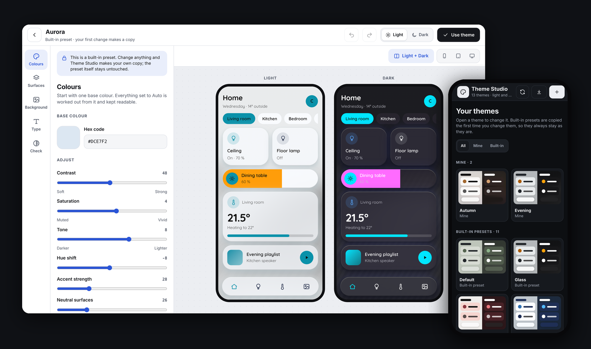
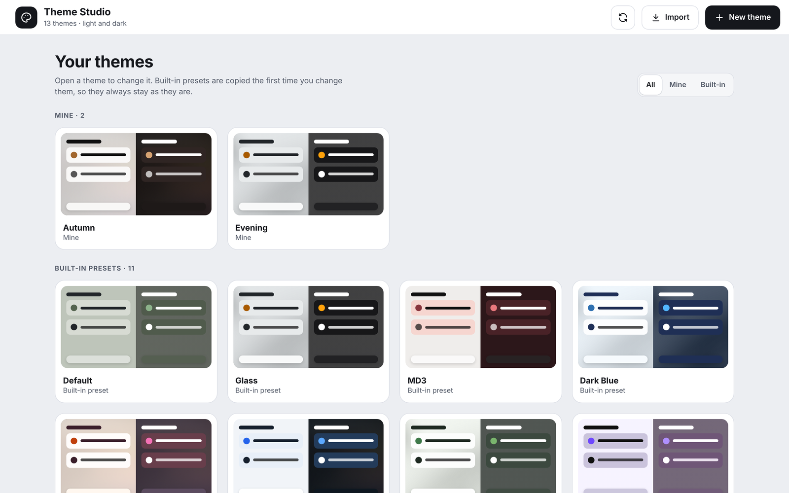
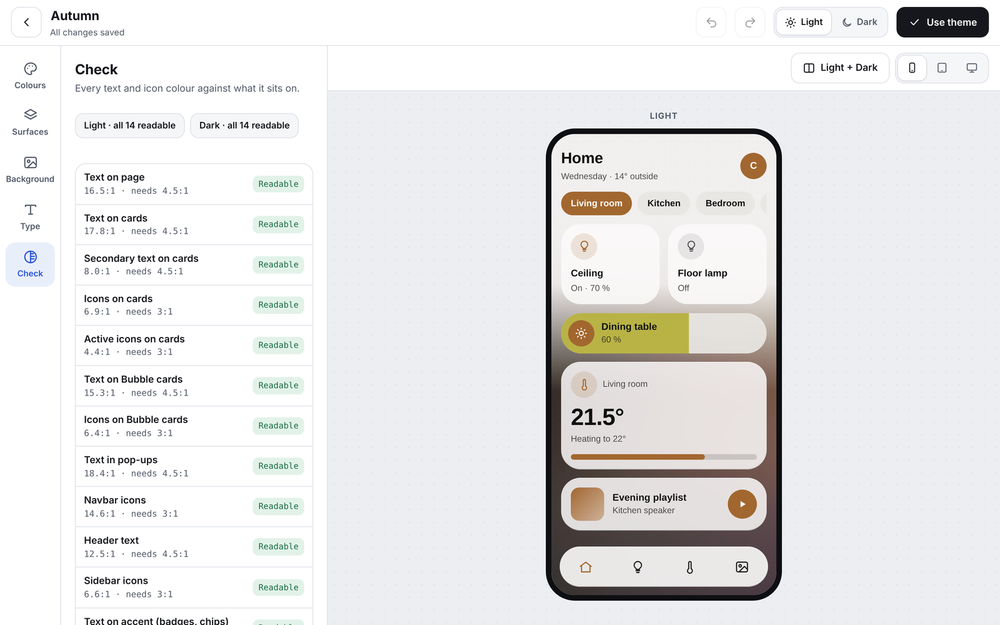
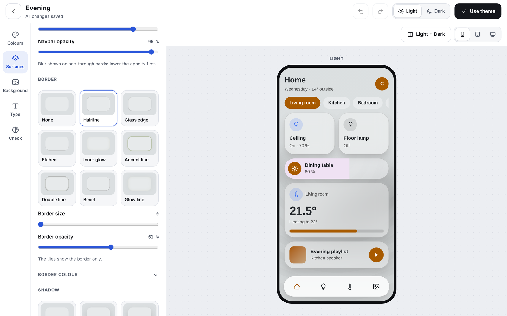
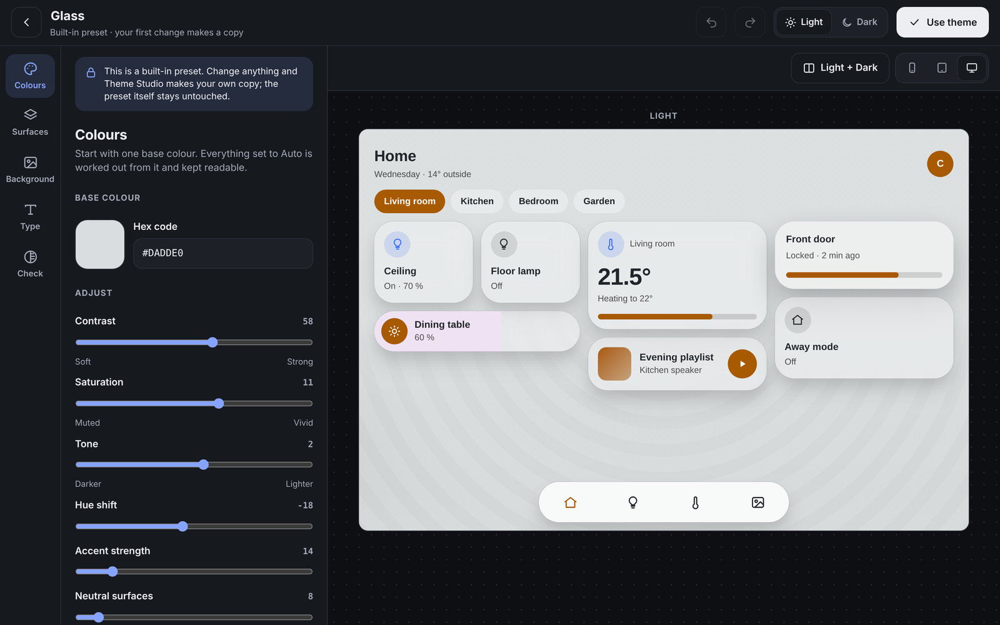
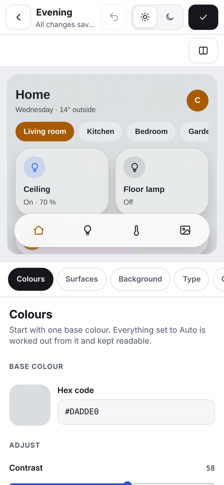
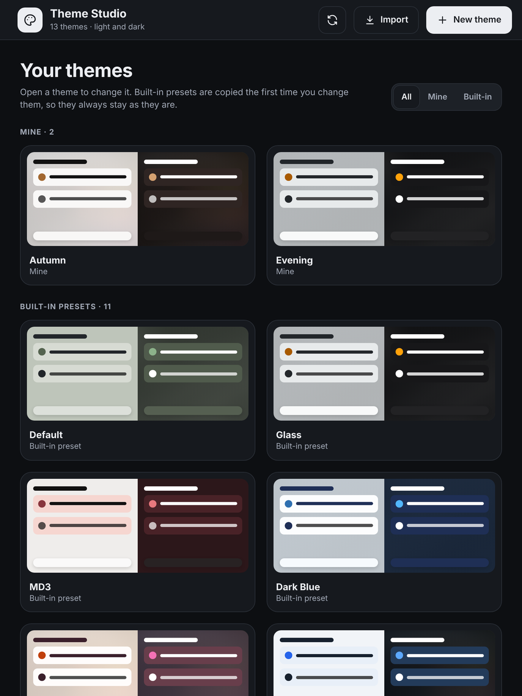

# Theme Studio

<p align="center">
  
</p>

<p align="center">
  <b>Design complete Home Assistant themes in your sidebar</b><br>
  One base colour in, a readable light and dark theme out, with a live preview on phone, tablet and computer.
</p>

<p align="center">
  <a href="https://github.com/Dinnsen/theme-studio/releases"></a>
  <a href="https://github.com/hacs/integration"></a>
  
  <a href="https://github.com/Dinnsen/theme-studio/actions/workflows/tests.yml"></a>
  <a href="LICENSE"></a>
</p>

<p align="center">
  
</p>

---

## Features

- **A page of its own:** Theme Studio adds a panel to the sidebar. No YAML, no dashboard, no custom cards.
- **One colour is enough:** a full theme from a single base colour, or from a background image.
- **Light and Dark** edited side by side and saved separately; changing one never changes the other.
- **Readable by default:** every text and icon colour is checked for contrast (WCAG), with a one-click fix.
- **Built-in presets** to start from; the first change makes your own copy.
- **Surfaces, borders, shadows, glass blur, backgrounds, overlays and fonts**, all previewed live.
- **Use a theme** for yourself or for everyone with one button.
- **Share** a theme as a short code or a file, and import one from someone else.
- **Fonts included** and served by your own Home Assistant, with no request to Google.
- **Seven languages:** Danish, German, English, Spanish, French, Norwegian and Swedish, with a guided tour for first-time users.
- Generated themes work on their own: no card-mod needed.

## Contents

- [Screenshots](#screenshots)
- [Requirements](#requirements)
- [Installation](#installation)
- [Updating from 0.x](#updating-from-0x)
- [The Theme Studio panel](#the-theme-studio-panel)
- [Guide and languages](#guide-and-languages)
- [Options](#options)
- [What Theme Studio changes](#what-theme-studio-changes)
- [File structure](#file-structure)
- [Fonts](#fonts)
- [Theme variables for your own dashboards](#theme-variables-for-your-own-dashboards)
- [Services](#services)
- [FAQ](#faq)
- [Uninstall](#uninstall)
- [Contributing](#contributing)

## Screenshots

| Your themes | Check |
| --- | --- |
|  |  |
| **Surfaces** | **Dark mode** |
|  |  |

| Phone | Tablet |
| --- | --- |
|  |  |

## Requirements

- Home Assistant **2026.3** or newer.
- [HACS](https://hacs.xyz/).

Nothing else: no custom cards and no changes to `configuration.yaml`.

## Installation

[](https://my.home-assistant.io/redirect/hacs_repository/?owner=Dinnsen&repository=theme-studio&category=integration)

1. Install **Theme Studio** via HACS.
2. Restart Home Assistant.
3. Add **Theme Studio** under Settings → Devices & services → *Add integration*.
4. Open **Theme Studio** in the sidebar.

Theme Studio adds its themes to Home Assistant and loads its fonts itself.

**Themes from YAML (optional).** If you prefer, `frontend: themes: !include_dir_merge_named themes` in `configuration.yaml` keeps working. Turn off *Add Theme Studio's themes to Home Assistant* in the [options](#options) to rely on it only.

## Updating from 0.x

Theme Studio 1.0 is the panel. The YAML dashboard, its package, the 110 editor helpers, the catalog and contrast sensors and the live theme *Theme Studio Dynamic* are gone. Everything they did is in the panel.

When 1.0 starts the first time it:

- renames these files to `<file>.bak_YYYYMMDD_HHMMSS`, so they no longer load but can be restored by hand:
  - `/config/packages/theme_studio_dynamic.yaml`
  - `/config/lovelace/theme_studio_dashboard.yaml`
  - `/config/themes/theme_studio_dynamic.yaml`
  - `/config/themes/theme_studio/theme_studio_dynamic.yaml`
- deletes the generated preset previews in `/config/www/theme_studio/previews/`;
- removes the old `number.`, `text.`, `switch.`, `select.`, `button.` and `sensor.theme_studio_*` entities.

Your user themes, built themes, background images and exports are not touched.

Then:

1. **Restart Home Assistant** once more, so the old scripts and automations are unloaded. *Settings → Repairs* reminds you.
2. **Remove the `theme-studio` dashboard block** under `lovelace: dashboards:` in `configuration.yaml`, if you added it. *Repairs* tells you while it is still there. `homeassistant: packages:` can stay if you use other packages.
3. If a dashboard or your profile used **Theme Studio Dynamic**, pick another theme, for example *Theme Studio Standard* or one of your own.
4. **Recorder:** the `*.theme_studio_*` exclude for the old helpers can be removed.
5. **Fonts:** dashboard resources you added for Theme Studio's fonts (Google Fonts links) can be removed.

These services were only used by the dashboard and are removed: `generate`, `save`, `load`, `save_as_new`, `undo`, `copy_variant`, `copy_preset`, `palette_from_image`, `refresh_catalogs` and `set_options`. If your own automations call one of them, see [Services](#services) for what is left.

## The Theme Studio panel

Theme Studio adds its own page to the sidebar: **Theme Studio** with a palette icon.

- **Your themes:** every built-in preset and user theme as a card with a light and a dark preview. The theme in use is marked.
- **New theme:** from a preset or one of your themes, from one colour, or from a background image.
- **Edit** a theme and see it straight away on a phone, a tablet or a computer, in Light, Dark or both side by side. The preview uses the theme's real colours.
- **Colours:** one base colour, sliders for contrast, saturation, tone and more, and every colour with the same *Auto / Manual* switch and its contrast. Manual colours are never changed by Theme Studio. *Colour model* picks how shades are calculated: **hsl** (classic) or **oklch**, which keeps the perceived brightness even across hues.
- **Surfaces:** card and chip corners, opacity and glass blur, nine border styles and nine shadow styles shown as tiles (border tiles show only the border, shadow tiles only the shadow), size, opacity and colour of both, and whether Bubble cards and pop-ups get them.
- **Background:** image visibility, pick an image from `/config/www/background` or **upload** one (PNG, JPEG, WebP or GIF, up to 15 MB; the file is checked and never overwrites another), 15 overlays as tiles with strength, start, size and spread, the header blend, and whether the background **stays put** behind the cards or **scrolls with the page**.
- **Type:** the font as tiles, or your own font with its family name and file.
- **Same for Light and Dark:** in Surfaces, Background and Type one switch applies a change to both variants. It is off by default and remembered per theme in the browser.
- **Check:** all 14 text and icon pairs. *Use Auto* switches the manual colours of a pair that is hard to read back to automatic.
- **Saving is automatic.** Built-in presets are never changed: the first change makes your own copy. Undo and Redo work for everything you did since you opened the theme. The first save of a theme each time Home Assistant starts keeps a `.bak_YYYYMMDD_HHMMSS` copy next to it, and deleting a theme keeps one too.
- **Use theme** writes the theme file and either sets it in your profile (*Just me*, on all your devices) or makes it the default theme for everyone (*Everyone*: your profile then follows the default; other people who picked their own theme in their profile keep it). After more changes, use it again to update it.
- **Share:** copy a share code or download a theme file. **Import** on the start page takes a share code or a file and makes a new theme; nothing is overwritten.
- *Make Dark from Light* copies one variant into the other on purpose, with the lightness turned around.
- Works on phones, tablets and computers, also in the Home Assistant app, and follows Home Assistant's dark mode. Only administrators can change themes.
- **?** opens the [guide](#guide-and-languages) and the language picker.

The panel's source lives in [`frontend/`](frontend/); see its README for how it is built.

## Guide and languages

The first time an administrator opens the panel, a short welcome offers two guides:

- **Quick start** (7 steps): make a theme, pick the base colour, Light and Dark, check readability, the preview and *Use theme*.
- **All functions** (30 steps): every button and setting, chapter by chapter, from the theme list to the contrast check.

Each step highlights the button or setting it explains and shows a small animated drawing of it. *Next*, *Back* and *Skip* (or the arrow keys and Esc) move through it. On a phone the explanation slides up from the bottom so the highlighted part stays visible. The guide never changes your themes. Skip it, and it is always under the **?** button in the top bar (on a phone: next to the filter on the start page and at the end of the section chips in the editor).

**Languages:** Danish, German, English, Spanish, French, Norwegian (bokmål) and Swedish, for the whole panel, the guide, the integration's settings and the notifications from the export and import services. By default the panel follows each person's Home Assistant language (anything else falls back to English). The *Language* option sets one language for everyone, and each person can still pick their own on the guide's welcome; that choice is remembered for their user on every device.

## Options

Settings → Devices & services → Theme Studio → *Configure*:

| Option | Default | What it does |
| --- | --- | --- |
| Overwrite existing managed files | on | Updates the built-in presets and *Theme Studio Standard* when Theme Studio starts. Turn off to keep your own edits to them. |
| Create backups before overwriting | on | Keeps a `.bak_YYYYMMDD_HHMMSS` copy of a managed file before it is updated. |
| Show the Theme Studio panel in the sidebar | on | Turn off to remove the panel. |
| Only administrators can open the panel | on | Turn off to let every user open it. |
| Add Theme Studio's themes to Home Assistant (no YAML needed) | on | Theme Studio puts its themes into Home Assistant's theme list and adds them again after *Reload themes*. It uses Home Assistant's internal theme list; if a future version changes it, Theme Studio logs a warning and you can use the YAML line instead. |
| Load the fonts that come with Theme Studio | on | Turn off if you load fonts yourself. |
| Language | Automatic | The language of the panel, its guide and the notifications. *Automatic* follows each person's Home Assistant language. Also asked when you add the integration. |

Each user can also hide or move the panel with Home Assistant's own *Edit sidebar*.

## What Theme Studio changes

- **Managed files are updated on start.** The built-in presets and *Theme Studio Standard* are refreshed every time the integration starts. A changed file is backed up first as `<file>.bak_YYYYMMDD_HHMMSS`. User themes in `/config/theme_studio/user_themes/` are never touched.
- **Your default theme is left alone** until you press *Use theme → Everyone*.
- **Theme files stay current.** When Theme Studio starts, the themes you use (files in `/config/themes/theme_studio/`) are rebuilt if a newer Theme Studio would build them differently. Themes you never used are not built.
- **Readable colours by default.** Automatic text, icon, navbar and header colours are picked by real (WCAG) contrast against the page, the cards and Bubble cards, and an automatic accent is darkened or lightened until it reaches 3:1. Text on the accent colour (badges, chips) follows the accent. Colours you set yourself are never changed; the panel shows the contrast instead.
- **No global layout CSS.** Themes do not hide the header, change view padding, blur every card or limit the width of sidebar views. Use [Kiosk Mode](https://github.com/NemesisRE/kiosk-mode) or your own card-mod if you want that.
- **No entities, no shell commands.** Theme Studio adds no entities and starts no subprocess.

## File structure

```text
/config/theme_studio/presets/                 built-in presets (managed)
/config/theme_studio/user_themes/             your themes (never overwritten)
/config/theme_studio/imports/                 drop theme files here for theme_studio.import_user_theme
/config/themes/theme_studio_standard.yaml     Theme Studio Standard, light + dark (managed)
/config/themes/theme_studio/<theme>.yaml      themes you use (written by Use theme)
/config/www/background/                       background images (yours are kept)
/config/www/theme_studio/exports/             files written by theme_studio.export_user_theme
```

## Fonts

Theme Studio ships Inter, Quicksand, Josefin Sans, Orbitron and Iosevka Charon Mono (Latin characters, including æ, ø and å) and loads them on every Home Assistant page itself. They are served by your own Home Assistant: no request goes to Google, nothing has to be added as a dashboard resource, and they work without internet. Roboto, system-ui and sans-serif come with Home Assistant and your devices. Orbitron has no ø/Ø of its own; the browser draws those two letters in a fallback font.

To use Google Fonts instead, turn off *Load the fonts that come with Theme Studio* in the [options](#options).

**Your own font:** put the file (`.woff2`, `.woff`, `.ttf` or `.otf`) in `/config/www/fonts/`, then in the panel under Type → *Your own font* switch it on and enter the family name and `/local/fonts/<file>`. Theme Studio loads it for you.

The fonts are licensed under the SIL Open Font License; the licences are in `custom_components/theme_studio/frontend/fonts/`. `scripts/build_fonts.py` rebuilds them from the Google Fonts repository.

## Theme variables for your own dashboards

Generated themes expose these variables for use in card-mod, button-card and Bubble Card styles:

| Variable | Purpose |
| --- | --- |
| `--theme-studio-soft-background-color` | Raised surface (chips, tiles) |
| `--theme-studio-panel-background-color` | Recessed panel surface |
| `--theme-studio-sub-button-background-color` | Bubble sub-button surface |
| `--theme-studio-chip-radius` | Chip/button radius |
| `--theme-studio-bubble-slider-color` | Bubble slider fill |
| `--theme-studio-navbar-background-color` | Navbar background |
| `--theme-studio-navbar-primary-color` | Navbar icon color |
| `--theme-studio-card-shadow-css` | Card border effect + shadow |
| `--theme-studio-header-blend-height` | Height of the header fade |
| `--theme-studio-header-blend-enabled` | `1` or `0` |
| `--theme-studio-card-backdrop-filter` | Glass blur from the *Blur* slider, e.g. `blur(17px)` – opt in per card |

Cards also get Home Assistant's native variables directly (`--ha-card-background`, `--ha-card-border-radius`, `--ha-card-box-shadow`, dialog and switch colors and `--ha-color-primary-05` … `--ha-color-primary-95`), so standard cards follow the theme without card-mod.

Blur is deliberately **not** applied to every card, because transparent cards (headers, chips, overlays) would get a blurred box behind them. Add it where you want glass:

```yaml
card_mod:
  style: |
    ha-card {
      backdrop-filter: var(--theme-studio-card-backdrop-filter);
      -webkit-backdrop-filter: var(--theme-studio-card-backdrop-filter);
    }
```

## Services

The panel does not need these; they are for your own automations and scripts.

| Service | What it does |
| --- | --- |
| `theme_studio.build_theme` | Writes a user theme or preset with light and dark mode to `/config/themes/theme_studio/`. |
| `theme_studio.theme_from_image` | Creates a new user theme with a light and a dark variant from an image in `/config/www/background` and checks its contrast. |
| `theme_studio.export_user_theme` | Writes a user theme to `/config/www/theme_studio/exports/` and returns it as JSON and as a share code. A notification links to the file. Files in `/config/www/` can be opened without logging in by anyone who knows the address, so delete an export when you no longer need it. The panel's *Share* writes nothing. |
| `theme_studio.import_user_theme` | Creates a new user theme from JSON or a share code. Without data it imports every `.json`/`.txt` file in `/config/theme_studio/imports/` and renames them to `.imported`. Never overwrites a theme; a name that is taken gets a number. |
| `theme_studio.delete_user_theme` | Deletes a user theme and its built theme file, keeping a `.bak_YYYYMMDD_HHMMSS` copy of the user theme (as *Delete* in the panel does). |
| `theme_studio.save_preset` | Creates or updates a user theme from a settings payload; with `active_variant` only that variant is written. Built-in presets are never written. |
| `theme_studio.initialize_assets` / `theme_studio.reinstall_assets` | Installs the managed files again and returns what changed. |

## FAQ

**Do I need card-mod, Bubble Card or any other custom card?**
No. The panel and the generated themes work without them. If you use Bubble Card, the themes style it too.

**Does Theme Studio change my dashboards?**
No. It only adds themes. A theme is used when you pick it in your profile, set it on a dashboard view, or press *Use theme*.

**Can I edit a built-in preset?**
Yes: open it and change anything. Theme Studio makes your own copy on the first change; the preset itself stays as it is.

**Why does someone still see another theme after *Everyone*?**
Home Assistant keeps the theme you pick per user, and that choice wins over the default theme. *Use theme → Just me* sets it for your user; *Everyone* sets the default theme and makes your user follow it. Other users who picked a theme in their profile keep it until they choose *Use default theme* there.

**Where are my themes stored, and how do I back them up?**
In `/config/theme_studio/user_themes/` as JSON files. They are part of every Home Assistant backup. To move one to another installation, use *Share* and *Import*.

**I updated from 0.x and still see the old dashboard.**
Restart Home Assistant once more and remove the `theme-studio` block from `configuration.yaml`; see [Updating from 0.x](#updating-from-0x).

## Uninstall

1. Remove the integration in Settings → Devices & services. Theme Studio deletes its managed files (presets, *Theme Studio Standard* and their `.bak_*` backups, and the backups of the old dashboard files). Your user themes in `/config/theme_studio/user_themes/`, themes in `/config/themes/theme_studio/` and images in `/config/www/background/` are kept.
2. Uninstall it in HACS.
3. Restart Home Assistant.

## Contributing

Bug reports and ideas are welcome as [issues](https://github.com/Dinnsen/theme-studio/issues/new/choose). See [CONTRIBUTING.md](CONTRIBUTING.md) for how to build the panel and run the tests, and [CHANGELOG.md](CHANGELOG.md) for what changed in each version.

## Support

If you like Theme Studio, you can [buy me a coffee](https://buymeacoffee.com/dinnsen).

## Licence

[MIT](LICENSE)
